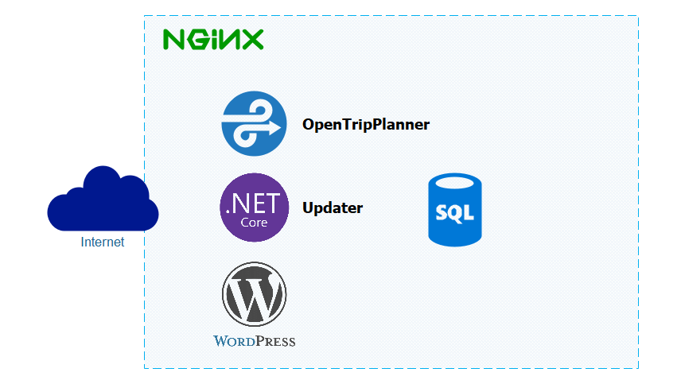
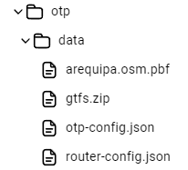

# Arequipa Bus - Server
## Introduction

The server structure is based on Docker and NGINX due to their security management and scalability. For this reason, each service should be considered a Docker module/container that is added to the NGINX service.

### Server Structure



## Modules
- OpenTripPlanner: It is the main service of the server; it calculates the most suitable route for a query.
- Updater: It is responsible for handling queries for services with different purposes.
- Postgres: It is the database that records the necessary data for the app.
- Wordpress

### OpenTripPlanner

It can calculate optimized routes by integrating different means of transportation.
For its operation, it requires two files.

|File Type                                |Format|Function                        |
|-----------------------------------------|------|--------------------------------|
|GTFS (General Transit Feed Specification)|Zip   |Public transportation data      |
|PBF (Protocolbuffer Binary Format)       |Pbf   |Road and mobility infrastructure|

#### Creation of the GTFS and PBF files

##### GTFS
The updated data to create the GTFS file is available in OpenStreetMap. To download and organize the data in GTFS format, it is necessary to use the tool provided by Trufi. [Trufi GTFS Builder](https://github.com/trufi-association/trufi-gtfs-builder)

##### PBF
You must obtain the .pbf file for Peru or South America from Geofabrik or BBBike.

Example to download Peru from Geofabrik:

```bash
wget https://download.geofabrik.de/south-america/peru-latest.osm.pbf

```

To extract only Arequipa, you can use Osmium or Osmosis:

- [Download osmium-tool](https://osmcode.org/osmium-tool/)
- [Download osmosis](https://github.com/openstreetmap/osmosis/releases/latest)

Define the boundaries of Arequipa in a .poly file. You can generate it from [polygons.openstreetmap.fr](https://polygons.openstreetmap.fr/)
Then, execute the following command to clip:

```bash
# Osmium
osmium extract --polygon=arequipa.poly peru-latest.osm.pbf -o arequipa.osm.pbf
```

Use the approximate boundaries of Arequipa
```bash
# Osmosis
osmosis --read-pbf peru-latest.osm.pbf --bounding-box top=-16.28546234927424 left=-71.68530956865706 bottom=-16.577267400595446 right=-71.44366525499784 --write-pbf arequipa.osm.pbf
```

## Configuration - Nginx

For server configuration, we can use the application [Trufi Server](https://github.com/trufi-association/trufi-server) provided by Trufi to manage the different services, adding the necessary extensions to the NGINX configuration file.

```conf
location /otp/ {
    proxy_pass http://otp:8080/otp/;
}
location /Survey/ {
    proxy_pass http://updater:5000/Survey/;
}
```

## Installation

To start the server installation, the only requirement is that Docker is installed and available.

### Preparation

The files (GTFS and PBF) must be located in the directory `otp/data`.



Once the requirements have been reviewed, the following command should be executed to proceed with the installation.

```bash
docker compose build
```

Then, the following command should be executed to start the server execution.

```bash
docker compose up
```

For the proper functioning of each module, we will describe more details in the following sections.

### Update GTFS and PBF

Replace the files (GTFS and PBF) in the directory `otp/data` with their new versions (either one or both) and execute the command.

```bash
docker compose build otp --no-cache
```
